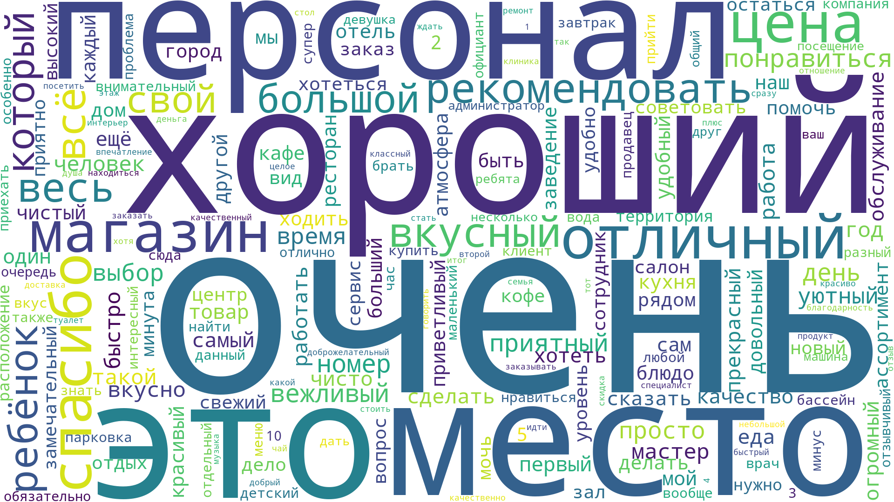
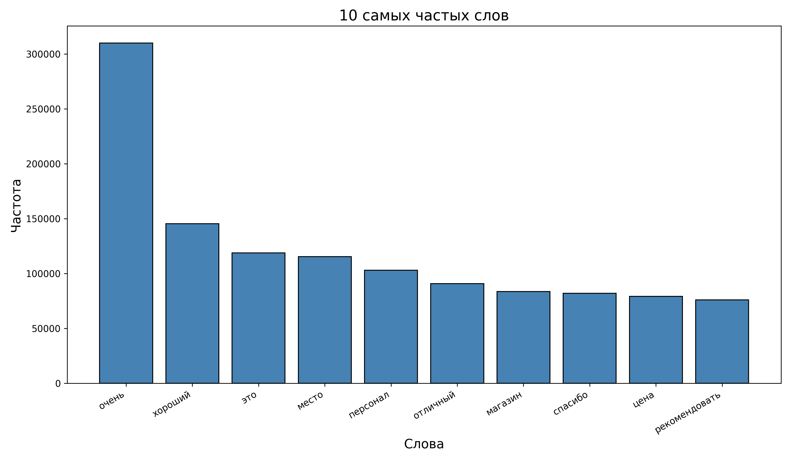

# Анализ частотности слов

Программа для предобработки текстов и построения визуализаций самых частых слов  
в виде **облака слов** (*wordcloud*) или **столбчатой диаграммы** (*bar chart*).  
Поддерживает входные файлы формата `.txt` и `.tskv` (или `.tsv`).

## Возможности

- Очистка текста (удаление HTML-тегов, ссылок, эмодзи, пунктуации и стоп-слов).
- Токенизация и лемматизация с помощью **NLTK** и **pymorphy3**.
- Подсчёт частотности слов.
- Визуализация результата:
    - облако слов;
    - столбчатая диаграмма 10 самых частых слов;
    - оба варианта сразу.
- Выбор обрабатываемого столбца для `.tskv` файлов.

## Установка

```bash
git clone https://github.com/Lijnx/Text-Frequency-Analysis.git
cd Text-Frequency-Analysis
pip install -r requirements.txt
```

## Использование

```bash
python freq_analysis.py -i INPUT [-t {wordcloud,bar,both}] [-o OUTPUT] [-c COLUMN]
```

## Аргументы

* `-i, --input` — путь к входному файлу (`.txt` или `.tskv`) **(обязательный)**.
* `-t, --type` — тип визуализации:
    * `wordcloud` (по умолчанию) — облако слов
    * `bar` — столбчатая диаграмма
    * `both` — оба варианта
* `-o, --output` — имя выходного файла (например, `result.png`).
    Для `both` создаются файлы `<имя>_wordcloud.png` и `<имя>_bar.png`.
* `-c, --column` — имя столбца для обработки в `.tskv` файле (по умолчанию `"text"`).

## Примеры

Облако слов из `.tskv`:
```bash
python freq_analysis.py -i data.tskv -t wordcloud -o cloud.png
```

Столбчатая диаграмма из `.txt`:
```bash
python freq_analysis.py -i text.txt -t bar -o freq.png
```

Оба графика сразу:
```bash
python freq_analysis.py -i text.txt -t both -o report.png
# создаст report_wordcloud.png и report_bar.png
```

## Пример результата

Датасет для примера взят с [yandex/geo-reviews-dataset-2023](https://github.com/yandex/geo-reviews-dataset-2023/tree/master)

### Облако слов


### Столбчатая диаграмма

